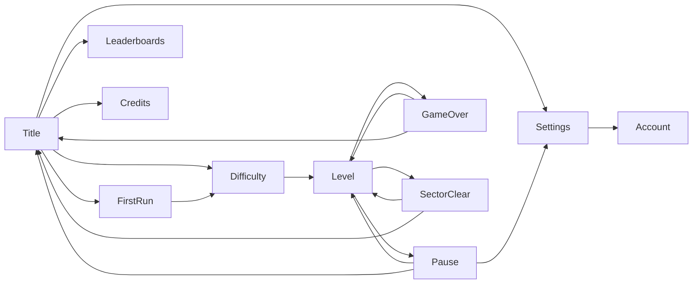

---
tags:
  - gdd
  - ui
status: approved
updated: 2026-09-25
---

# UI Flow and Screens

## Scenes
`Title` (menus) and `Level`, the one scene the game is played in: every campaign level and an Endless run all play there, the level itself being data rather than a scene. Loading a level shows it immediately; there is no separate loading screen yet.

## Flow

## Screens
- **Title:** "YASS 2026" logo; **Play**, **Leaderboards**, **Settings**, **Credits**, **Quit** (as in the original; "Tell a Friend" is dropped). Quit is hidden on WebGL and mobile. **Play** goes to the difficulty screen, or asks for a pilot name first if the player has never given one.
- **Difficulty select:** Cadet, Pilot, Ace, each with a one-line description; then the run starts. Pilot is selected by default, being the intended fight. **Endless** is a switch on the same screen, not a fourth difficulty: turning it on means the difficulty chosen next starts an Endless run instead of a campaign. It is shown but dead until the campaign has been completed. _Provisional: chosen while building the mode._
- **Account:** two screens, because signing in and managing an account are different moments. The **first-run screen** is asked once, on the way into the first run: a pilot name for the boards, **Sign in with Unity**, and **Play without an account**, which is remembered. The **account screen** lives behind Settings and is where it is changed later: **Sign out**, **Use a different account**, and **Manage account**, which opens Unity's own portal for changing or recovering a password. Only the buttons that apply are shown, and while an attempt is in flight none of them can be pressed, because the sign-in page is outside the game and a second attempt on top of the first would race it. Whatever the service says comes back on one line above the buttons, in the player's words; that line keeps its place whether or not it says anything, so the buttons do not move under the player's hand.
- **The game never sees a password.** Signing in opens Unity's page in the system browser and the game waits for a token. Creating an account, changing a password and recovering a forgotten one are all Unity's, which is the point of using Unity accounts: credentials the game cannot see are credentials it cannot leak.
- **Leaderboards:** any of the six boards ([[Scoring]]), chosen with two cycling buttons, Campaign/Endless and the difficulty. The top 10, with the player's own run in the highlight colour, and one line above the buttons saying which board is showing. It opens on the board the player last played. A board that cannot be reached is not an error: the screen shows the player's own runs from this machine and says so in a line, and every button still works.
- **Pause** (Esc, gamepad Start/Menu, on-screen button): Resume, Restart, Settings, Quit to Title. Game time stops while paused.
- **Settings:** Pilot name (always editable: it is a label the boards show, not the account), Music volume, Sound effects volume, Screen shake (on/off), Fullscreen (desktop only, hidden elsewhere). The name is written when the player leaves the box, not on every keystroke, so cleaning it cannot fight them mid-word. Saved between sessions, as soon as each is changed, so leaving by any route keeps it, and **in force from the moment the game opens**, not from the moment the Settings screen is first visited. Fullscreen is the one setting the game hands back: the saved value is applied once at start-up, after which the window is the player's to change with Alt+Enter or the window chrome and the game follows it. **Account** opens the account screen, and is hidden in a level, where there is no account screen to open. Reachable from Title and Pause. Defaults: music 0.7, effects 0.9, screen shake on, fullscreen on.
- **Credits:** DFT Games Studios, the 2010 original, AI tools used, packages.
- **Game Over:** score, kills, best chain of the run; Retry, Title. An Endless run also reports the cycle it reached. Once the board answers, a line reports where the run placed; a run that could not be submitted shows nothing there rather than a rank it does not have.
- **Sector Clear:** the run's score, bonus points earned (level clear, no-damage boss, max-level upgrades) and kills; **Continue** moves on to the next level of the campaign.
- **Campaign ending:** shown instead of Sector Clear after the campaign's last level, with the run's final score, kills and best chain, and its placing on the board once that arrives; Title.

Results screens appear **1.5 seconds** after the run ends, so the last explosion is not hidden by a panel. They cannot be paused or dismissed with Back: the player leaves them by choosing a button.

## Navigation
Every menu works with keyboard (arrows, Enter, Esc), gamepad (stick/D-pad, south to confirm, east to go back) and mouse. The first button is selected when a menu opens, so the menus are usable without touching the mouse; a locked entry (Endless) never takes that selection.

**Back** (Esc or the gamepad's east button) leaves the open screen and returns to the one it was opened from: Settings goes back to the Title or to Pause depending on where it was opened. In a level, Back with nothing open opens the pause menu, and the gamepad's Start button toggles pause.

Back to [[00 GDD Home]]
