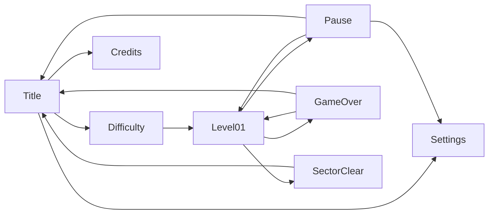

---
tags:
  - gdd
  - ui
status: approved
updated: 2026-09-19
---

# UI Flow and Screens

## Scenes
`Title` (menus) and one scene per level (`Level01`). Loading a level shows it immediately; there is no separate loading screen yet.

## Flow

## Screens
- **Title:** "YASS 2026" logo; **Play**, **Settings**, **Credits**, **Quit** (as in the original; "Tell a Friend" is dropped). Quit is hidden on WebGL and mobile.
- **Difficulty select:** Cadet, Pilot, Ace, each with a one-line description; then the Campaign starts. **Endless** is shown but locked until the campaign is completed.
- **Pause** (Esc, gamepad Start/Menu, on-screen button): Resume, Restart, Settings, Quit to Title. Game time stops while paused.
- **Settings:** Music volume, Sound effects volume, Screen shake (on/off), Fullscreen (PC only). Saved between sessions. Reachable from Title and Pause.
- **Credits:** DFT Games Studios, the 2010 original, AI tools used, packages.
- **Game Over:** score, kills, highest chain; Retry, Title.
- **Sector Clear:** score breakdown (level score, level-clear bonus, no-damage boss bonus), kills; Continue (to Title while only level 1 exists).

## Navigation
Every menu works with keyboard (arrows, Enter, Esc), gamepad (stick/D-pad, south to confirm, east to go back) and mouse. The first button is selected when a menu opens.

Back to [[00 GDD Home]]
