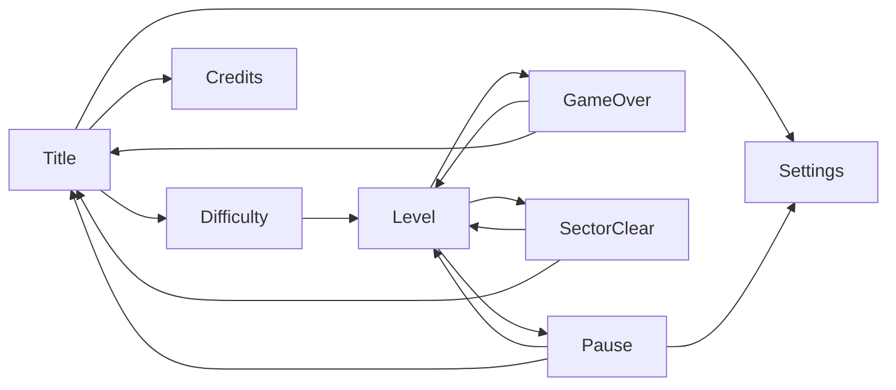

---
tags:
  - gdd
  - ui
status: approved
updated: 2026-09-22
---

# UI Flow and Screens

## Scenes
`Title` (menus) and `Level`, the one scene the game is played in: every campaign level and an Endless run all play there, the level itself being data rather than a scene. Loading a level shows it immediately; there is no separate loading screen yet.

## Flow

## Screens
- **Title:** "YASS 2026" logo; **Play**, **Settings**, **Credits**, **Quit** (as in the original; "Tell a Friend" is dropped). Quit is hidden on WebGL and mobile.
- **Difficulty select:** Cadet, Pilot, Ace, each with a one-line description; then the run starts. Pilot is selected by default, being the intended fight. **Endless** is a switch on the same screen, not a fourth difficulty: turning it on means the difficulty chosen next starts an Endless run instead of a campaign. It is shown but dead until the campaign has been completed. _Provisional: chosen while building the mode._
- **Pause** (Esc, gamepad Start/Menu, on-screen button): Resume, Restart, Settings, Quit to Title. Game time stops while paused.
- **Settings:** Music volume, Sound effects volume, Screen shake (on/off), Fullscreen (desktop only, hidden elsewhere). Saved between sessions, as soon as each is changed, so leaving by any route keeps it, and **in force from the moment the game opens**, not from the moment the Settings screen is first visited. Fullscreen is the one setting the game hands back: the saved value is applied once at start-up, after which the window is the player's to change with Alt+Enter or the window chrome and the game follows it. Reachable from Title and Pause. Defaults: music 0.7, effects 0.9, screen shake on, fullscreen on.
- **Credits:** DFT Games Studios, the 2010 original, AI tools used, packages.
- **Game Over:** score, kills, best chain of the run; Retry, Title. An Endless run also reports the cycle it reached.
- **Sector Clear:** the run's score, bonus points earned (level clear, no-damage boss, max-level upgrades) and kills; **Continue** moves on to the next level of the campaign.
- **Campaign ending:** shown instead of Sector Clear after the campaign's last level, with the run's final score, kills and best chain; Title.

Results screens appear **1.5 seconds** after the run ends, so the last explosion is not hidden by a panel. They cannot be paused or dismissed with Back: the player leaves them by choosing a button.

## Navigation
Every menu works with keyboard (arrows, Enter, Esc), gamepad (stick/D-pad, south to confirm, east to go back) and mouse. The first button is selected when a menu opens, so the menus are usable without touching the mouse; a locked entry (Endless) never takes that selection.

**Back** (Esc or the gamepad's east button) leaves the open screen and returns to the one it was opened from: Settings goes back to the Title or to Pause depending on where it was opened. In a level, Back with nothing open opens the pause menu, and the gamepad's Start button toggles pause.

Back to [[00 GDD Home]]
